Command Reference
=================

.. note:: All keybindings are customizable. This list shows their defaults.
          You can use the
          `-\\-show-bindings <cli.html#cmdoption-quicktile-show-bindings>`_
          option to view your current keybindings.

.. contents::
   :local:

Window Tiling
-------------

.. _top-left:

``top-left``
^^^^^^^^^^^^

Default Keybinding: :kbd:`Ctrl` + :kbd:`Alt` + :kbd:`Keypad 7`

Tile the active window to span the top-left quarter of the screen. Press the hotkey multiple times to cycle through different width presets.

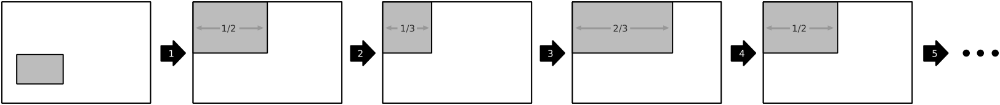

``top``
^^^^^^^

Default Keybinding: :kbd:`Ctrl` + :kbd:`Alt` + :kbd:`Keypad 8`

Tile the active window to span the top half of the screen. Press the hotkey multiple times to cycle through different width presets.

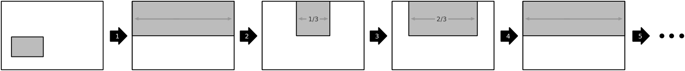

``top-right``
^^^^^^^^^^^^^

Default Keybinding: :kbd:`Ctrl` + :kbd:`Alt` + :kbd:`Keypad 9`

Tile the active window to span the top-right quarter of the screen. Press the hotkey multiple times to cycle through different width presets.

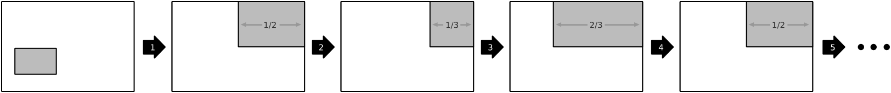

``left``
^^^^^^^^

Default Keybinding: :kbd:`Ctrl` + :kbd:`Alt` + :kbd:`Keypad 4`

Tile the active window to span the left half of the screen. Press the hotkey multiple times to cycle through different width presets.

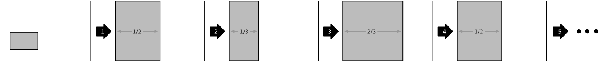

``center``
^^^^^^^^^^

Default Keybinding: :kbd:`Ctrl` + :kbd:`Alt` + :kbd:`Keypad 5`

Tile the active window to fill the screen. Press the hotkey multiple times to cycle through different width presets.

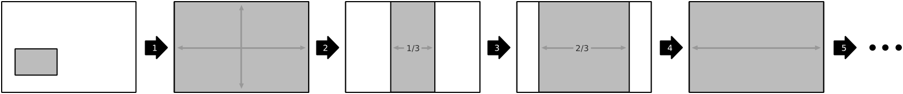

``right``
^^^^^^^^^

Default Keybinding: :kbd:`Ctrl` + :kbd:`Alt` + :kbd:`Keypad 6`

Tile the active window to span the right half of the screen. Press the hotkey multiple times to cycle through different width presets.

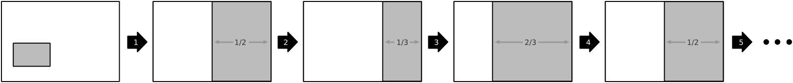

``bottom-left``
^^^^^^^^^^^^^^^

Default Keybinding: :kbd:`Ctrl` + :kbd:`Alt` + :kbd:`Keypad 1`

Tile the active window to span the bottom-left quarter of the screen. Press the hotkey multiple times to cycle through different width presets.

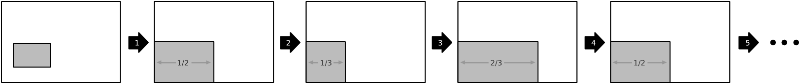

``bottom``
^^^^^^^^^^

Default Keybinding: :kbd:`Ctrl` + :kbd:`Alt` + :kbd:`Keypad 2`

Tile the active window to span the bottom half of the screen. Press the hotkey multiple times to cycle through different width presets.

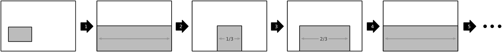

``bottom-right``
^^^^^^^^^^^^^^^^

Default Keybinding: :kbd:`Ctrl` + :kbd:`Alt` + :kbd:`Keypad 3`

Tile the active window to span the bottom-right quarter of the screen. Press the hotkey multiple times to cycle through different width presets.

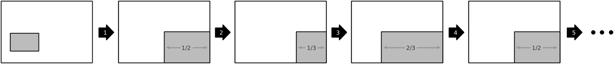

Window Movement
---------------

``move-to-top-left``
^^^^^^^^^^^^^^^^^^^^

Move the active window to the top-left corner of the screen without altering its shape.

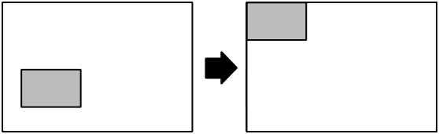

``move-to-top``
^^^^^^^^^^^^^^^

Move the active window to the center of the top edge of the screen without
altering its shape.

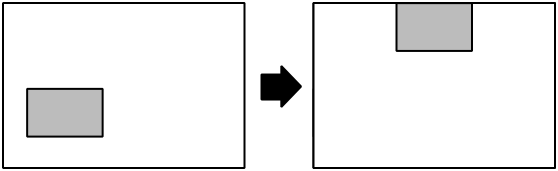

``move-to-top-right``
^^^^^^^^^^^^^^^^^^^^^

Move the active window to the top-right corner of the screen without altering its shape.

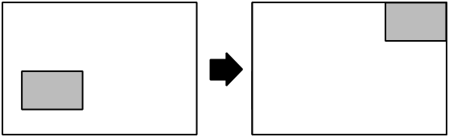

``move-to-left``
^^^^^^^^^^^^^^^^

Move the active window to the center of the left edge of the screen without
altering its shape.

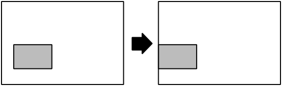

``move-to-center``
^^^^^^^^^^^^^^^^^^

Default Keybinding: :kbd:`Ctrl` + :kbd:`Alt` + :kbd:`C`

Move the active window to the center of the screen without altering its shape.

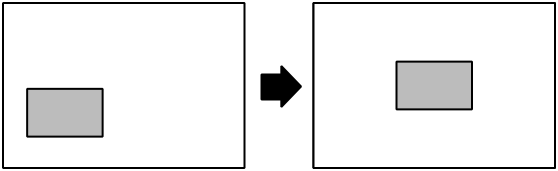

``move-to-right``
^^^^^^^^^^^^^^^^^

Move the active window to the center of the right edge of the screen without
altering its shape.

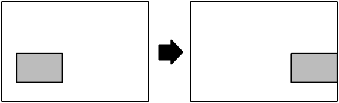

``move-to-bottom-left``
^^^^^^^^^^^^^^^^^^^^^^^

Move the active window to the bottom-left corner of the screen without altering its shape.

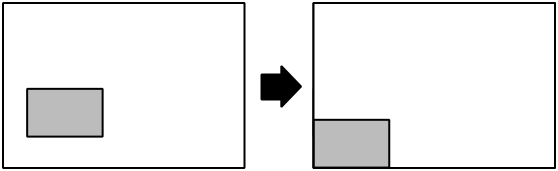

``move-to-bottom``
^^^^^^^^^^^^^^^^^^

Move the active window to the center of the bottom edge of the screen without
altering its shape.

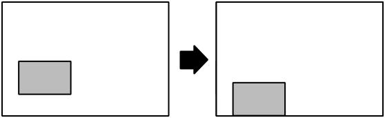

``move-to-bottom-right``
^^^^^^^^^^^^^^^^^^^^^^^^

Move the active window to the top-right corner of the screen without altering its shape.

.. image:: diagrams/png/move-to-bottom-right.png
   :alt: diagram

Window State
------------

``always-above``
^^^^^^^^^^^^^^^^

Toggle whether the active window is rendered on a layer above normal windows
and panels.

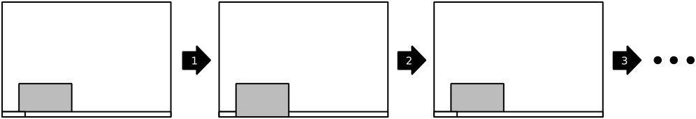

``always-below``
^^^^^^^^^^^^^^^^

Toggle whether the active window is rendered on a layer below normal windows.

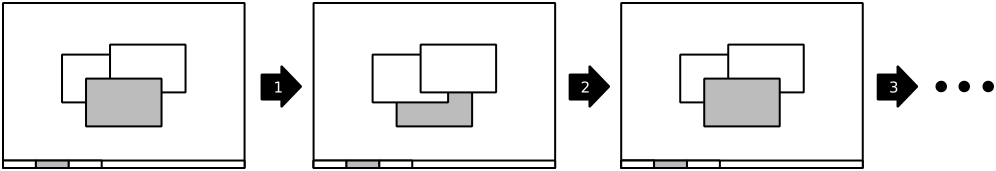

``bordered``
^^^^^^^^^^^^

Toggle whether the active window is rendered without a titlebar and borders.

Whether the window will expand to fill the space formerly taken by its titlebar
and borders will vary from window manager to window manager.

.. image:: diagrams/png/bordered.png
   :alt: diagram

``fullscreen``
^^^^^^^^^^^^^^

Toggle whether the active window is rendered fullscreen.

Fullscreene windows cover desktop panels and, on many compositors, will
have their rendering bypass the compositor for improved performance.

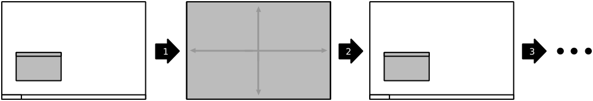

``horizontal-maximize``
^^^^^^^^^^^^^^^^^^^^^^^

Default Keybinding: :kbd:`Ctrl` + :kbd:`Alt` + :kbd:`H`

Toggle whether the active window is maximized horizontally, but with its height and vertical position unchanged.

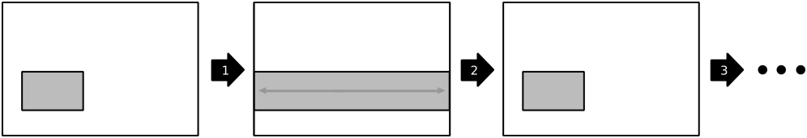

``maximize``
^^^^^^^^^^^^

Default Keybinding: :kbd:`Ctrl` + :kbd:`Alt` + :kbd:`0`

Toggle whether the active window is maximized to fill the "work area" of the monitor. (ie. not covering panels unless they're set to allow it.)

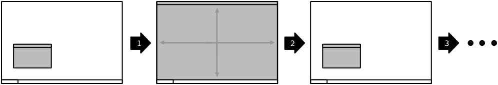

``minimize``
^^^^^^^^^^^^

Toggle whether the active window is minimized to the taskbar or equivalent.

.. image:: diagrams/png/minimize.png
   :alt: diagram

``shade``
^^^^^^^^^

Toggle whether the active window is as only a titlebar (like a rolled-up windowshade).

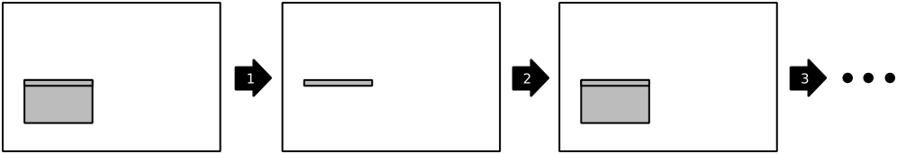

``vertical-maximize``
^^^^^^^^^^^^^^^^^^^^^

Default Keybinding: :kbd:`Ctrl` + :kbd:`Alt` + :kbd:`V`

Toggle whether the active window is maximized vertically, but with its width and horizontal position unchanged.

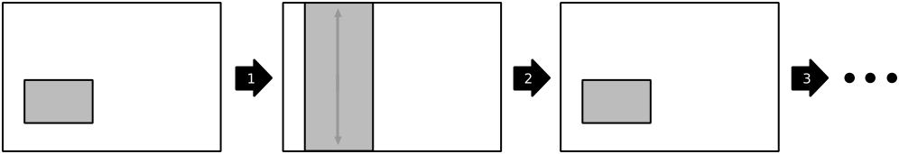

.. _monitor-*:

Multi-Monitor Operations
------------------------

.. note:: QuickTile for GTK+ 2.x used to preserve window positions within the
          limits of what the host window manager allowed, but it was discovered
          that, on a Kubuntu 16.04 LTS desktop consisting of both 1920x1024 and
          1280x1024 monitors, this could result in windows getting lost off the
          edge of the desktop.

          To avoid this, QuickTile for GTK 3.x clamps the position of the
          window to within the usable region of the target monitor.

          When further internal reworks make it possible, the intent is for
          QuickTile to remember the window's position on a per-monitor basis
          so that this position clamping is non-destructive to the user's
          desired layout.

          However, in the interim, please open a feature request on the issue
          tracker if you would make use of a configuration file option to
          disable this safety feature.

.. _monitor-next:

``monitor-next``
^^^^^^^^^^^^^^^^

Move the active window to the next monitor, as defined by the
:abbr:`WM (Window Manager)`'s internal numbering.

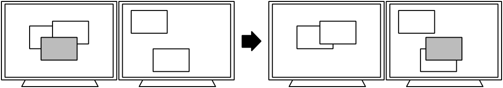

.. _monitor-next-all:

``monitor-next-all``
^^^^^^^^^^^^^^^^^^^^

Move *all* windows to the next monitor, as defined by the
:abbr:`WM (Window Manager)`'s internal numbering.

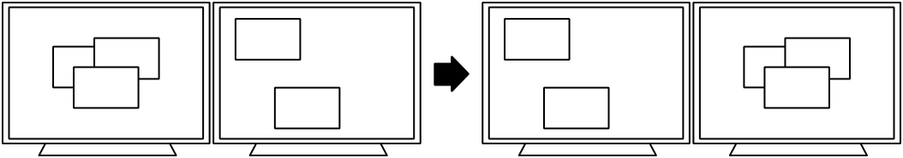

``monitor-switch``
^^^^^^^^^^^^^^^^^^

Default Keybinding: :kbd:`Ctrl` + :kbd:`Alt` + :kbd:`Keypad Enter`

An alias for :ref:`monitor-next <monitor-next>` which will wrap around
regardless of the value of the :ref:`MovementsWrap <MovementsWrap>` setting in
the configuration file.

.. todo:: Brainstorm ways to distinguish the ``-next`` and ``-switch`` commands
   visually that don't overcomplicate the illustrations.

``monitor-switch-all``
^^^^^^^^^^^^^^^^^^^^^^

An alias for :ref:`monitor-next-all <monitor-next-all>` which will wrap around
regardless of the value of the :ref:`MovementsWrap <MovementsWrap>` setting in
the configuration file.

.. todo:: Come up with less ambiguous iconography for ``monitor-*-all``

``monitor-prev``
^^^^^^^^^^^^^^^^

Move the active window to the previous monitor, as defined by the
:abbr:`WM (Window Manager)`'s internal numbering.

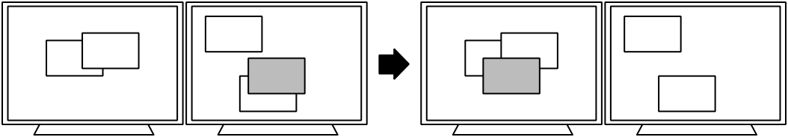

``monitor-prev-all``
^^^^^^^^^^^^^^^^^^^^

Move *all* windows to the previous monitor, as defined by the
:abbr:`WM (Window Manager)`'s internal numbering.

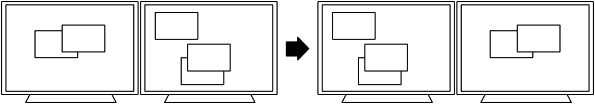

.. _workspace-go-*:

Workspace-wise Navigation
-------------------------

.. _workspace-go-next:

``workspace-go-next``
^^^^^^^^^^^^^^^^^^^^^

Switch focus to the next workspace, by the :abbr:`WM (Window Manager)`'s
internal numbering. Do not move any windows.

For users who have laid out their workspaces in a row or column, this is
equivalent to :ref:`workspace-go-right` or :ref:`workspace-go-down`,
respectively, with the possible exception of wrap-around behaviour.

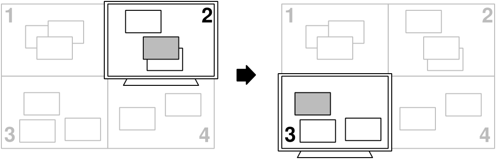

.. _workspace-go-prev:

``workspace-go-prev``
^^^^^^^^^^^^^^^^^^^^^

Switch focus to the previous workspace, by the :abbr:`WM (Window Manager)`'s
internal numbering. Do not move any windows.

For users who have laid out their workspaces in a row or column, this is
equivalent to :ref:`workspace-go-left` or :ref:`workspace-go-up`, respectively,
with the possible exception of wrap-around behaviour.

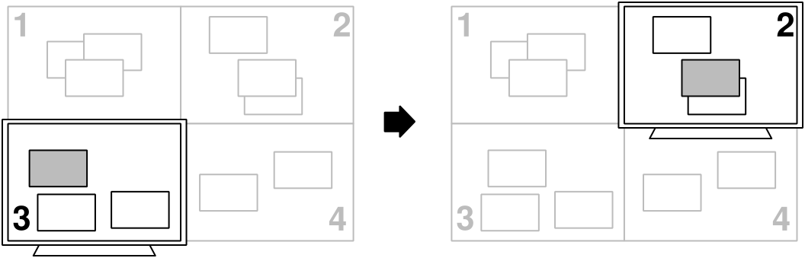

.. _workspace-go-left:

``workspace-go-left``
^^^^^^^^^^^^^^^^^^^^^

Switch focus to the left in the grid of workspaces. Do not move any windows.

For users who have laid out their workspaces in a row, this is equivalent to
:ref:`workspace-go-prev` with the possible exception of wrap-around behaviour.

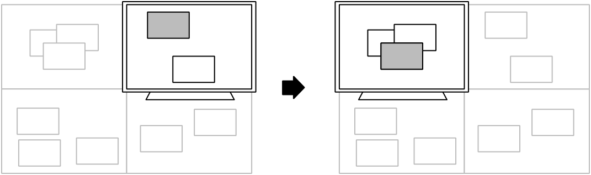

.. _workspace-go-right:

``workspace-go-right``
^^^^^^^^^^^^^^^^^^^^^^

Switch focus to the right in the grid of workspaces. Do not move any windows.

For users who have laid out their workspaces in a row, this is equivalent to
:ref:`workspace-go-next` with the possible exception of wrap-around behaviour.

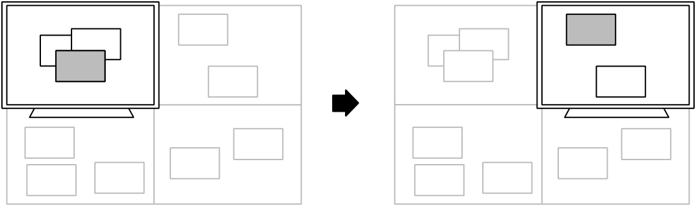

.. _workspace-go-up:

``workspace-go-up``
^^^^^^^^^^^^^^^^^^^

Switch focus upward in the grid of workspaces. Do not move any windows.

For users who have laid out their workspaces in a column, this is equivalent to
:ref:`workspace-go-prev` with the possible exception of wrap-around behaviour.

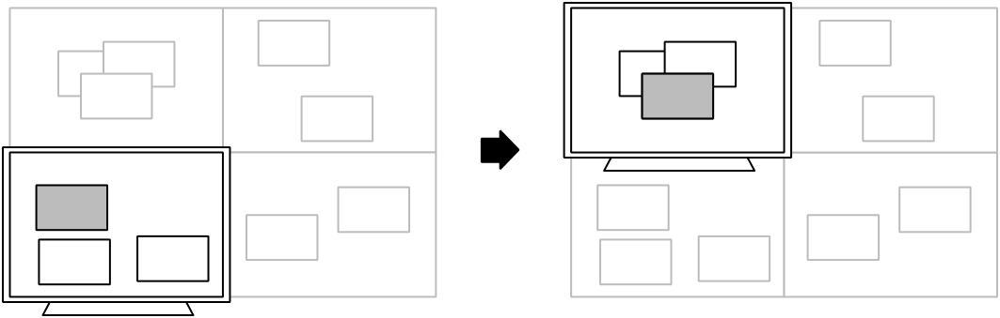

.. _workspace-go-down:

``workspace-go-down``
^^^^^^^^^^^^^^^^^^^^^

Switch focus downward in the grid of workspaces. Do not move any windows.
For users who have laid out their workspaces in a column, this is equivalent to
:ref:`workspace-go-next` with the possible exception of wrap-around behaviour.

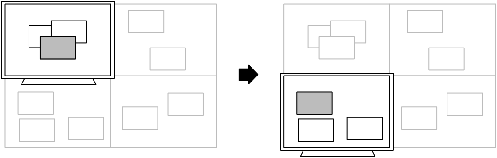

.. _workspace-send-*:

Workspace-wise Window Manipulation
----------------------------------

.. todo:: Decide whether to rework the ``workspace-send-*`` commands to *mean*
    ``workspace-bring-*``, to add such commands, or to rework the internals
    so it's easy to dispatch a "send, then go" sequence from a single binding.

``all-desktops``
^^^^^^^^^^^^^^^^

Toggle whether the active window appears on all desktop/workspaces

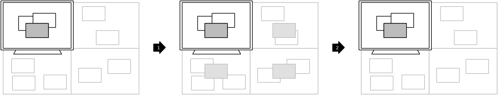

.. _workspace-send-next:

``workspace-send-next``
^^^^^^^^^^^^^^^^^^^^^^^

Ask the :abbr:`WM (Window Manager)` to move the active window to the next
workspace, as defined by internal numbering.

For users who have laid out their workspaces in a row or column, this is
equivalent to :ref:`workspace-send-right` or :ref:`workspace-send-down`,
respectively, with the possible exception of wrap-around behaviour.

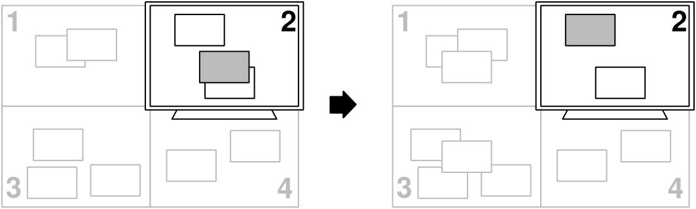

.. _workspace-send-prev:

``workspace-send-prev``
^^^^^^^^^^^^^^^^^^^^^^^

Ask the :abbr:`WM (Window Manager)` to move the active window to the previous
workspace, as defined by its internal numbering.

For users who have laid out their workspaces in a row or column, this is
equivalent to :ref:`workspace-send-left` or :ref:`workspace-send-up`,
respectively, with the possible exception of wrap-around behaviour.

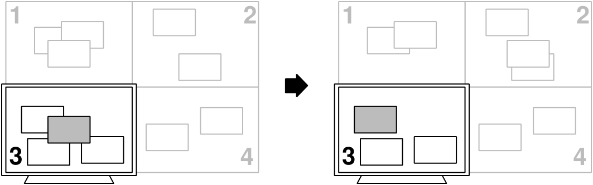

.. _workspace-send-left:

``workspace-send-left``
^^^^^^^^^^^^^^^^^^^^^^^

Ask the :abbr:`WM (Window Manager)` to move the active window to the left in
the grid of workspaces.

For users who have laid out their workspaces in a row, this is equivalent to
:ref:`workspace-send-prev` with the possible exception of wrap-around
behaviour.

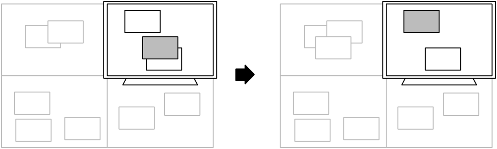

.. _workspace-send-right:

``workspace-send-right``
^^^^^^^^^^^^^^^^^^^^^^^^

Ask the :abbr:`WM (Window Manager)` to move the active window to the right in
the grid of workspaces.

For users who have laid out their workspaces in a row, this is equivalent to
:ref:`workspace-send-next` with the possible exception of wrap-around
behaviour.

.. image:: diagrams/png/workspace-send-right.png
   :alt: diagram

.. _workspace-send-up:

``workspace-send-up``
^^^^^^^^^^^^^^^^^^^^^

Ask the :abbr:`WM (Window Manager)` to move the active window upward in the
grid of workspaces.

For users who have laid out their workspaces in a column, this is equivalent to
:ref:`workspace-send-prev` with the possible exception of wrap-around
behaviour.

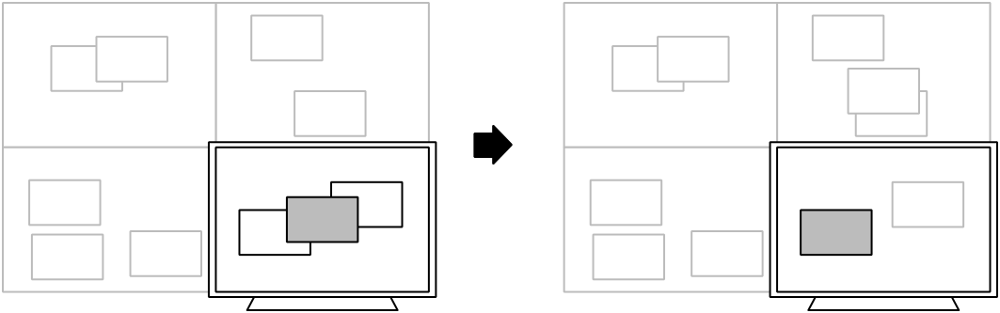

.. _workspace-send-down:

``workspace-send-down``
^^^^^^^^^^^^^^^^^^^^^^^

Ask the :abbr:`WM (Window Manager)` to move the active window downward in the
grid of workspaces.

For users who have laid out their workspaces in a column, this is equivalent to
:ref:`workspace-send-next` with the possible exception of wrap-around
behaviour.

Miscellaneous Functionality
---------------------------

``show-desktop``
^^^^^^^^^^^^^^^^

Ask the :abbr:`WM (Window Manager)` to toggle the visibility of all windows.

Be warned that some WMs will forget about this (it will degenerate into a
normal "everything manually minimized" state) if you re-show your windows
through any means other than triggering this behaviour a second time.

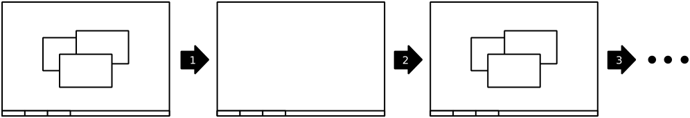

``trigger-move``
^^^^^^^^^^^^^^^^

Ask the :abbr:`WM (Window Manager)` to begin a "keyboard-driven move" operation
on the active window.

Typically, this is handled via the arrow keys but it's ultimately up to your
window manager to decide what it means.

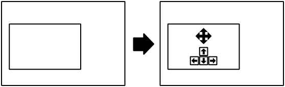

``trigger-resize``
^^^^^^^^^^^^^^^^^^

Ask the :abbr:`WM (Window Manager)` to begin a "keyboard-driven resize"
operation on the active window.

Typically, this is handled via the arrow keys but it's ultimately up to your
window manager to decide what it means.

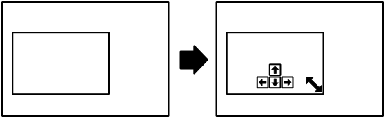

----

.. todo:: Move the descriptions in :doc:`commands` into the source code and
          then make it programmatically generated.

Special thanks to `David Stygstra <https://github.com/stygstra>`_ for creating
the initial 25 diagrams and establishing their style.
