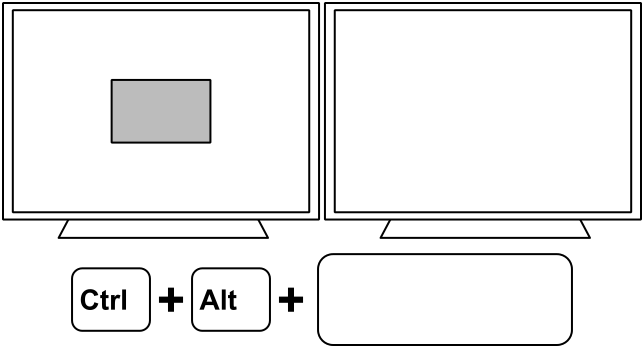

QuickTile
=========

QuickTile is a simple utility, inspired by WinSplit Revolution for Windows,
which adds window-tiling keybindings to your existing X11 window manager.

You can also think of it as a standalone alternative to the keyboard-related
features of the Compiz Grid plugin.

QuickTile adds no new visible UI elements. No tray icon that just wastes space
once you're done configuring it. Once it's set up, you've got your choice of
new global hotkeys, a new D-Bus API, and/or a new command to invoke from shell
scripts. That's it.

For more details, see the illustrations in the :doc:`commands`.

QuickTile depends on the Python bindings for libraries you :ref:`probably
already have <Dependencies>` and can be run :ref:`without installing
<install_quicktile.sh>` to easily try it out.

Manual Contents:

.. toctree::
   :maxdepth: 1

   installation
   usage
   commands
   config
   cli
   faq
   apidocs/index
   developing
   authors/index

* :ref:`modindex`
* :ref:`genindex`

.. |wrench| image:: wrench.png

|wrench| Please report any issues on GitHub at
`ssokolow/quicktile <https://github.com/ssokolow/quicktile/issues>`_

..
    bug.png and wrench.png from the Silk Icons set by Mark James, available at
    http://www.famfamfam.com/lab/icons/silk/
    are used under the Creative Commons Attribution 2.5 license.
